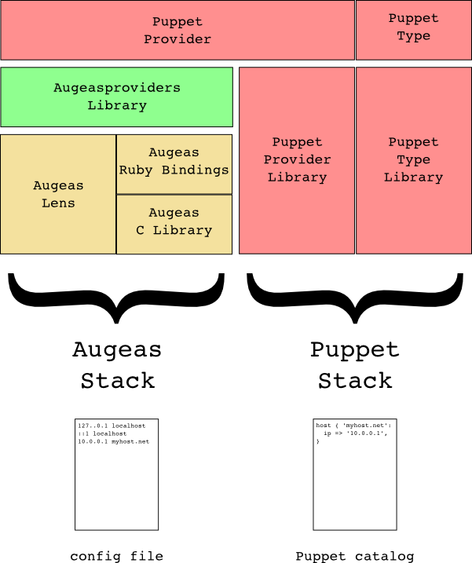

# Developing Puppet providers with `augeasproviders`

The `augeasproviders` library is a helper Ruby library to write Puppet providers allowing to manage files in parts, using Augeas.

This page describes the steps to create a provider using the `augeasproviders` API.

## Framework

## Puppet type

The first thing you need is a Puppet type. It could be an existing type or a new type.

Whether you use an existing type or create a new one, the type should:

* be ensurable
* have a `target` parameter, specifying which file to manage.

## Making use of the library in your provider

In order to create a new Augeas-based provider, you need to make it a child of the `default` provider of the `augeasprovider` type:

    Puppet::Type.type(:my_type).provide(:augeas, :parent => Puppet::Type.type(:augeasprovider).provider(:default)) do
      desc "Uses Augeas API to update my file"
    end

## Declaring the default target

You can declare the default target for your provider by using the `default_file` method:

    default_file do
      "/path/to/my/file"
    end

This method takes a block which is interpreted when the default file is needed. Consequently, you can use code in the block, basing yourself on informations such as facts (using the `facter` API) to determine the default file.

The default file path will be used to declare a `$target` Augeas variable, which you can then use in your Augeas paths whenever needed.

## Declaring the lens to use

The next thing `augeasproviders` needs to know if the lens to use on this file. You can declare it with the `lens` method:

    lens do
      "MyFile.lns"
    end

Again, the block is interpreted down the road so you can use code in this block.

In the event that you need information from the resource itself in order to determine which lens to use, the method can yield it to you. For example, if you have a `lens` parameter in your type, you can use:

    lens do |resource|
      resource[:lens]
    end
    

## Confining your provider

Since the `augeasproviders` library uses Augeas, it is safe to confine your provider so it is only considered by Puppet if the `augeas` feature is available. You can do this with:

    confine :feature => :augeas

## Declaring the resource path

The `augeasproviders` library can take care of automatically declaring some provider methods if you specify the path to your resource in the Augeas tree. In order to do that, use the `resource_path` method, which yields the resource. You should use the `$target` Augeas variable (set by the `default_file` method) to refer to the root of the file you are managing, for example:

    resource_path do |resource|
      "$target/#{resource[:name]}"
    end

Using the `resource_path` method will automatically declare two provider methods: 

* `exists?` (which checks if the resource path exists)
* `destroy` (which removes the resource path and saves the tree)

These two methods can be overridden in your provider if you need a more advanced behaviour.

The `resource_path` method is also used to define a `$resource` Augeas variable, which you can use in your Augeas expressions, alongside the `$target` variable.

## Manipulating the Augeas tree

When defining your provider methods, you will need to manipulate the Augeas tree. `augeasproviders` provides two useful methods for this: `augopen` and `augopen!`

The easiest way to use the `augopen` method is to pass it a block. It will then yield the Augeas handler to the block:

    augopen do |aug|
      aug.get('$resource')
    end

The `augopen` method will open Augeas with your file/lens combination alone (making it faster), safely manage Augeas errors, and close the Augeas handler at the end of the block.

If you need to perform a tree change with Augeas, the `augopen!` method behaves just like `augopen`, but saves the tree automatically:

    augopen! do |aug|
      aug.set('$resource', 'value')
    end

## Defining provider methods

One convenient way to declare a provider method which only calls Augeas to get or set in the tree is to use the `define_aug_method` or `define_aug_method!` methods:

    define_aug_method!(:destroy) do |aug, resource|
      aug.rm("$target/command[#{resource[:name]}]")
    end

Again, the `define_aug_method!` method will save the tree, while `define_aug_method` will not.

You can use the `define_aug_method!` method to define the `create` method, which is required for ensurable types and is not automatically created by Augeasproviders, e.g.:

    define_aug_method!(:create) do |aug, resource|
      aug.set("$target/#{resource[:name]}", resource[:value])
    end

## Defining property accessors

`define_aug_method` lets you define generic methods for your provider. For ensurable types, properties need two methods, for getting and setting the property value respectively. The Augeasproviders library helps you to do that by providing property accessor methods.

In all the examples below, `$resource` will map to a `resource` node with value `name`, represented as:

    { "resource" = "name" }

### Simple accessor

The simplest way to define a property accessor is:

    attr_aug_accessor(:foo)

Given `foo => "bar"`, this will set the tree to:

    { "resource" = "name"
      { "foo" = "bar" } }

This will manage a property called `foo`, whose value is stored as the value for the `foo` node of the `$resource` node.

Calling `attr_aug_accessor` defines both a reader and a writer methods, and is thus equivalent to calling:

    attr_aug_reader(:foo)
    attr_aug_writer(:foo)

These calls produce dynamic methods, named after the property you wish to control. In this case, they will be named respectively `attr_aug_reader_foo` and `attr_aug_writer_foo`. The standard ensurable methods `foo` and `foo=` are then automatically defined using these respective methods.

When calling these methods, the reader method takes an Augeas handler as parameter and returns the value as found in the file:

    value = attr_aug_reader_foo(aug)

while the writer method takes an Augeas handler and a value, and sets the value in the file:

    attr_aug_writer(aug, value)

### Accessor options

The case where a resource property maps directly to a sub-node in the tree with the same name and a simple value is not always met. For more complex situations, the accessor methods accept a series of options.

#### Property label

Very often, the name of the property you want to manage does not match the node label in the Augeas tree. The `:label` option lets you set this, e.g. for `foo => 'value'`:

    attr_aug_access(:foo,
      :label => 'my/foo'
    )

will manage a simple entry as:

    { "resource" = "name"
      { "my" { "foo" = "value" } } }

If the node to be used is the resource node itself instead of a sub-node, you can use `:resource` as the label, e.g.:

    attr_aug_access(:foo,
      :label => :resource
    )

will manage the entry as:

    { "resource" = "value" }

#### Property type

The property type defines the type of value to be managed, and can be one of the following values:

  * `:string`: the value is a string (default)
  * `:array`: the value is an array
  * `:hash`: the value is a hash

##### String value

When the value is set as a string, the reader method returns the value of the node referred to, and the writer method sets the value of the node if a value is given, or clears it otherwise, e.g. for `foo => "bar"`:

    attr_aug_accessor(:foo,
      :type => :string
    )

maps to:

    { "resource" = "name"
      { "foo" = "bar" } }

If you need the sub-node to be removed rather than cleared when the value is set to `nil` (or not set), use the `:rm_node` option:

    attr_aug_accessor(:foo,
      :type => string,
      :rm_node => true
    )

##### Array value

Augeas has two ways of representing array values in its trees, using either fix labels or sequential entries (see [this page](http://www.redhat.com/archives/augeas-devel/2011-February/msg00053.html) for an explanation of why both of them exist).

For this reason, property accessors offer 3 ways to manage arrays, using the `sublabel` option:

  * the values are all the nodes matching the path with the given label (`sublabel` not set), e.g. for `foo => ["bar", "baz"]`:
        
        attr_aug_accessor(:foo,
          :type     => :array
        )

    maps to:

        { "resource" = "name"
          { "foo" = "bar" }
          { "foo" = "baz" } }

  * the values are sub-nodes of the path with the given label (`sublabel` set to the label of the sub-nodes), e.g. for `foo => ["bar", "baz"]`:
        
        attr_aug_accessor(:foo,
          :type     => :array,
          :sublabel => 'sub'
        )

    maps to:

        { "resource" = "name"
          { "foo"
            { "sub" = "bar" }
            { "sub" = "baz" } } }

  * the values are sequential entries under the path with the given label (`sublabel` set to `:seq`), e.g. for `foo => ["bar", "baz"]`:
        
        attr_aug_accessor(:foo,
          :type     => :array,
          :sublabel => :seq
        )

    maps to:

        { "resource" = "name"
          { "foo"
            { "1" = "bar" }
            { "2" = "baz" } } }

In all cases, all existing values are purged before setting the target values.

##### Hash value

In the Augeas tree, hash values are represented by sub-nodes, with optional values (the `:sublabel` option is used to set the value node name). When no value is found in the tree, the accessor method will default to the value of the `:default` option. 

For example, given `foo => { "a" => "bar", "b" => "baz" }`, with:

    attr_aug_accessor(:foo
      :type     => :hash,
      :default  => "baz",
      :sublabel => "val"
    )

will produce:

    { "resource" = "name"
      { "foo"
        { "a"
          { "val" = "bar" } }
        { "b" # No value here because "baz" is the default value
          } } }

Note that only one level of hash depth is currently supported.

