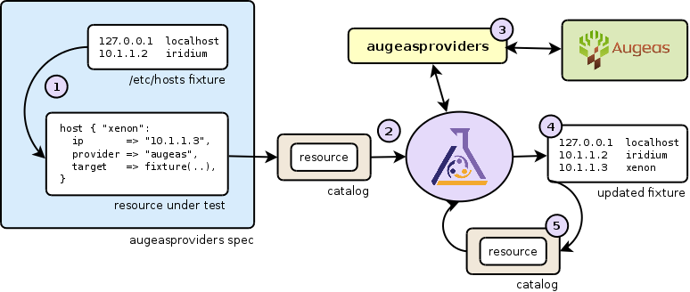
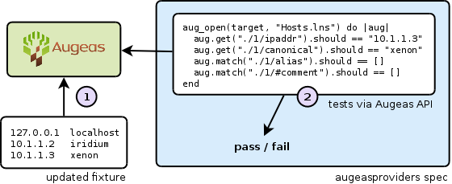
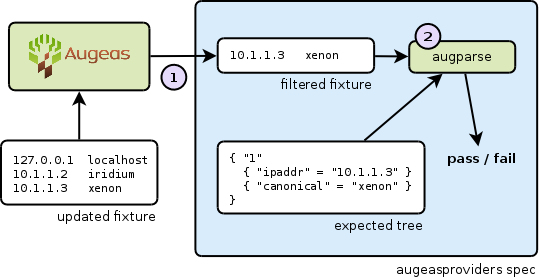

# Testing techniques for Puppet providers using Augeas

_The following blog post was written in September 2012, so may be out of date in
places.  Originally published
[here](http://m0dlx.com/blog/Testing_techniques_for_Puppet_providers_using_Augeas.html)._

Over the past few months I've continued working on augeasproviders,
a Puppet module that implements a few providers which use the Augeas
configuration API to modify files.  One of the interesting challenges has been
testing providers, which I'm going to explain in this entry.

The challenge appears quite simple: the provider will alter the contents of a
config file by adding, removing or editing a line and the spec (that is, a set
of [RSpec](http://rspec.info) examples using the
[puppetlabs_spec_helper](https://github.com/puppetlabs/puppetlabs_spec_helper))
has to test this was successful.  Unlike core Puppet providers which may alter
package databases and entire system state, augeasproviders operates only on
individual files and so it can be run safely within a test harness.

The main flow of testing is shown above and follows ths sequence:

  1. A temporary copy is made of a fixture file (sample input file) which here is
     a typical /etc/hosts file.
     The resource is created on the fly from the type, referencing the temporary copy
     made of the fixture.

  2. The resource is added to a Puppet catalog instance and the catalog,
     containing a single resource is applied using Puppet.  This tests the provider
     in a near "real life" setting, as all normal provider functionality will be
     used.

  3. Puppet will call methods to create, destroy or change individual parts of
     an existing resource via getter/setter methods.  In augeasproviders, these use
     the [Augeas API](http://augeas.net/docs/api.html) to open the target
     file, make the change or retrieve the value and close the file.

  4. The catalog run will complete and the temporary fixture will have been
     updated with any changes made.  If there have been any resource failures or log
     messages at warning or above, the spec fails.

  5. A second catalog run is now performed in order to catch idempotency
     problems, which shouldn't produce any further changes.
     If a getter and setter aren't consistent, then Puppet will attempt
     to set a property on every run since the two implementations differ.
     This useful test discovered
     [a few issues](https://github.com/hercules-team/augeasproviders/commit/897b35d)
     in augeasproviders.

Now the updated fixture is complete, the contents need to be tested.
Originally tests were using the Augeas API again to load the fixture and then
check certain parts of the tree.  Since the file has been persisted to disk
using a lens that is tested and typechecked upstream, this is pretty safe
and allows us to skip
over implementation details such as whitespace formatting within the output.

Unfortunately it's a very verbose way of testing.  Improving on this was to
use the augparse utility shipped with Augeas, normally used for testing lenses
transform between a sample file and a given tree.  The spec was changed to
generate a module for augparse that took the fixture and an "expected
tree" in the spec and compared the two via the lens.

An additional feature of this was to filter the full fixture into just the
line that was _expected to change, meaning only part of the entire file
would need to be tested against a tree.  (Clearly a bad bug could cause
other parts to change, but it's a trade-off to maintain the tree text for the
entire file.)

The above techniques used to test the [augeasproviders
code](https://github.com/hercules-team/augeasproviders)
could easily be adapted into other provider tests, whether or not the provider
itself uses the Augeas API.

__Update:__ the new idempotency code and all the fixes it's helped with
have now been released as [version
0.3.0](http://forge.puppetlabs.com/domcleal/augeasproviders).
